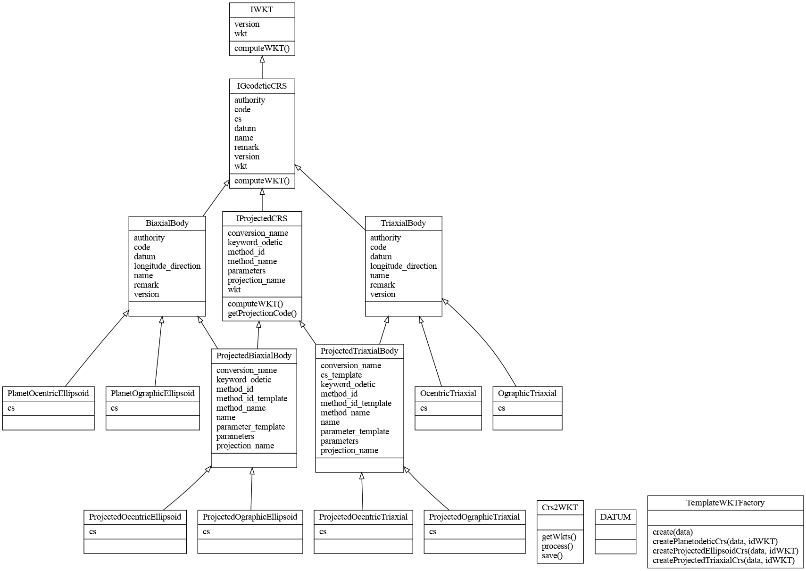

.. wkt documentation master file, created by
   sphinx-quickstart on Sun Apr 11 13:48:37 2021.
   You can adapt this file completely to your liking, but it should at least
   contain the root `toctree` directive.

Welcome to wkt's documentation!
===============================

.. toctree::
   :maxdepth: 2
   :caption: Contents:

   wkt

Indices and tables
==================

* :ref:`genindex`
* :ref:`modindex`
* :ref:`search`
